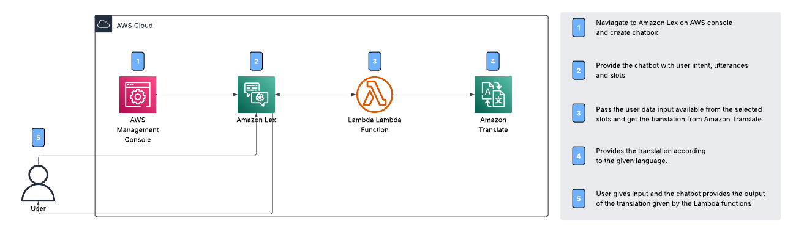
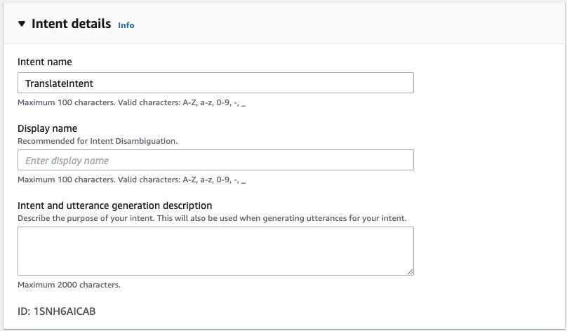
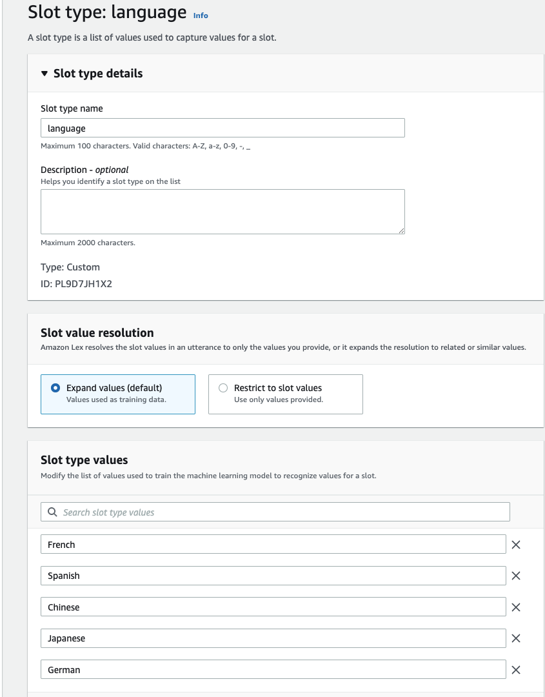
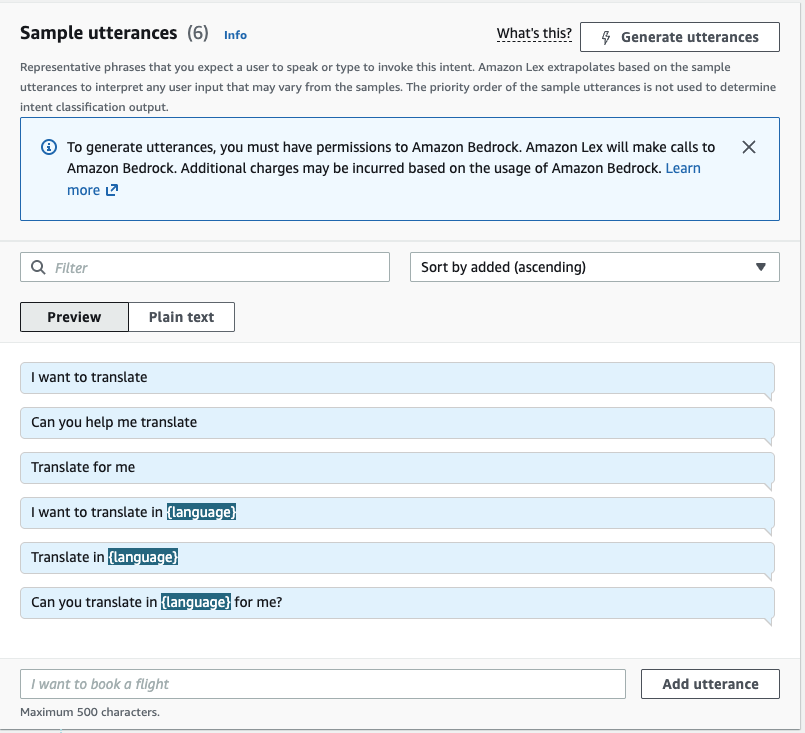
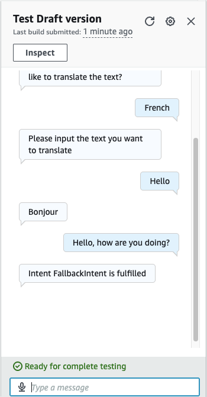

# Translation Bot with Lex

## 🌟 Overview 
In this project, we'll be building a language translation bot using Amazon Lex.
If you want to translate a word or sentence into another language, all you have to do is type it into the chatbot - and it will output the translation.

### 🛠️ Services used
* **Amazon Lex**: Build the chatbot and define conversation flow.
* **AWS Lambda**: Get the book recommendation using a third party API.
* **AWS IAM**: Ensures secure access by managing user permissions.
* **Amazon Translate**: Used for translation of the sentence according to the input language specified.

## ☁️ AWS Architecture

### Intent Details

### Custom Language Slot

### Sample utterances

## &rarr; Final Result

